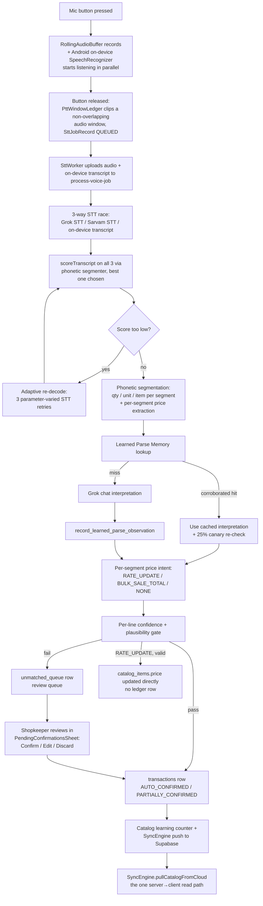

# Voice → Ledger: Architecture Blueprint

> Verified directly against source code on 2026-07-29 (not against `CLAUDE.md`/`audit.md` descriptions, which had drifted in places — discrepancies are called out inline). File:line references point at the actual implementation.

## 1. The goal

A shopkeeper holds one button, speaks a sale in Hindi/Hinglish/English, and releases it. The system must turn that single utterance into a **correct ledger entry** — right item, right quantity, right unit, right price — with as little manual correction as possible, while never silently booking a wrong or implausible sale.

The design bet: **accuracy over automation**. Every stage below either produces a high-confidence booking or explicitly defers to a human review queue — there is no path where a low-confidence guess gets auto-booked silently.

---

## 2. End-to-end flow

---

## 3. Stage-by-stage detail

### Stage 1 — Capture (on the phone, before any network call)

- **`RollingAudioBuffer`** keeps a rolling tape of raw audio so the exact moment of button-press isn't the start of the clip — a 300ms pre-roll and post-roll are added around single recordings.
- **`PttBurstCoalescer` & `PttWindowLedger`** (`HomeScreen.kt`) dynamically merge rapid back-to-back presses (< 600ms gap) into a single coalesced audio job spanning the burst, letting the multi-item segmenter/AI parser handle boundary splits at the semantic layer with zero audio overlap or truncation.
- **The moment the button is pressed**, Android's own on-device `SpeechRecognizer` (Google's local/system speech engine, `hi-IN` locale) also starts listening — independently of the audio recording (`OnDeviceSpeechRecognizer.kt`, wired in `HomeScreen.kt:271`). This is a **third, local transcription source**, not a diagnostic extra — see Stage 3.
- On release, the clipped audio is written as an `SttJobRecord` (status `QUEUED`) and handed to `SttWorker` via WorkManager (expedited, so it survives the app being backgrounded/killed).

### Stage 2 — Upload

`SttWorker` uploads the audio file to the Supabase Edge Function `process-voice-job`, along with the on-device transcript (if it finished in time — up to ~4s wait, then up to 1.8s more inside the uploader) and job metadata (hold duration, press/release timestamps, gap since the previous job).

### Stage 3 — The three-way STT race (`process-voice-job/index.ts`)

Three independent transcripts of the same audio are produced:

1. **Android on-device SpeechRecognizer** — already have it, phone-local, free, zero extra latency.
2. **Grok STT** (xAI `/v1/stt`) — cloud.
3. **Sarvam AI STT** — cloud, India-focused.

Each is run through the **same phonetic segmenter** and scored (`scoreTranscript()`, `index.ts:460`): +3 per segment that resolves to a real catalog item, +2 for an explicit (non-default) unit, +1 for a non-trivial quantity, −2 per implausible segment, −5 for Latin-script gibberish with zero recognized words (kills hallucinations like STT inventing an English phrase).

**Selection rule** (`index.ts:872-893`): the on-device transcript only wins if it scores *strictly higher* than both cloud transcripts **and** doesn't disagree with them on any spoken number (numbers become rupees — a numeric mismatch disqualifies it even if the wording otherwise looks better). Otherwise: Sarvam ≥ Grok > whichever isn't empty.

### Stage 4 — Adaptive re-decode (only if the winning score is still weak)

If `bestScore < 3` (`index.ts:918`) — meaning even the best transcript found no recognizable item or unit/quantity frame — the system fires **3 more STT calls in parallel, each varying decode parameters, not the audio window**:
- Grok with no keyterm bias and no language hint
- Sarvam with language auto-detect instead of forced Hindi
- Grok with a tight, catalog-only 25-term keyterm list

Each candidate is rescored, and the best one replaces the original choice if it scores higher.

> **Correction vs `CLAUDE.md`**: `CLAUDE.md` describes a client-side "Adaptive Audio Expansion Engine" that re-extracts a wider audio window (±100ms, up to 3 passes) from the rolling buffer. That code path is gone — confirmed by `BackgroundSttProcessor.kt`'s own header comment, which says the client-side pipeline (`processSingleJob`) was deleted as dead code. Re-decoding is now entirely server-side and varies *decode parameters*, not audio boundaries.

### Stage 5 — Phonetic segmentation (`phonetic.ts`)

`segmentTranscript()` tokenizes the winning transcript and runs a lattice-style decoder over a vocabulary built from the shop's catalog plus a **220-entry default item vocabulary** (Hindi + Latin spellings), producing typed tokens (`NUM` / `UNIT` / `ITEM`) per segment. Matching is done in **phonetic-key space** (`phoneticKey()`) — Devanagari and Latin spellings of the same word collapse to the same key, so cross-script STT noise doesn't block a match. A separate pass walks backward/forward from any spoken rupee word to attach a price to the correct segment, so a mid-sentence price doesn't get misread as its own extra item.

### Stage 6 — Interpretation: AI or memory (`index.ts`)

The chosen transcript is handed to **Grok chat** (a different model than Grok STT — this step *interprets meaning*, not audio) to produce structured items — **unless** a matching cached interpretation already exists:

- **Learned Parse Memory**: a `memoKey` (phonetic key of the normalized transcript) is looked up in `learned_parses`. A hit is only trusted if it's `promoted`, not `permanently_blocked`, the catalog hasn't changed since (`catalog_fingerprint` match), **and** the independent phonetic segmenter agrees item-for-item on this specific recording (`itemsCorroboratedBySegmenter`).
- **Promotion**: needs **2** distinct corroborated observations with **zero** corrections.
- **Demotion**: a canary mismatch, a catalog change, or a voided transaction demotes the memo; **2 demotions permanently blocks it**.
- **Canary**: even on a memory hit, 25% of the time (`LEARNED_PARSE_CANARY_RATE`) a real Grok call still runs in the background, non-blocking, purely to catch memory drift.
- Every fresh (non-memoized) Grok interpretation is recorded as a new observation.

### Stage 7 — Per-item price intent (`price_intent.ts`)

Each *segment* (not the whole sentence) is independently classified:
- **`RATE_UPDATE`** — a price was spoken with no leading quantity ("आलू का रेट तीस रुपये" → update the catalog price, no sale).
- **`BULK_SALE_TOTAL`** — both a quantity and a price were spoken ("चार किलो आलू तीस रुपये किलो" → a real sale at that rate).
- **`NONE`** — no price context; the catalog's standing price is used.

### Stage 8 — Confidence + plausibility gate (per line, not per utterance)

`isCommittable` requires **all** of:
- `confidence >= 0.80`
- `price_at_sale > 0` and `total > 0`
- a real, resolved item name (not "Unrecognized Item")
- `implausibility_reason === null`

`implausibilityReason()` independently blocks a line — regardless of confidence — when: quantity is non-positive; GRAM/ML is `<10` or `>5000`; KG/LITRE `>200`; PIECE/PACKET/DOZEN `>500`; total sale value `< ₹5`; or a spoken compound number ≥10 doesn't show up anywhere in the resolved qty/price/total (a numeric-consistency safety net).

Each line in a multi-item utterance is judged **independently** — one bad item no longer zeroes out the whole recording (that was a real, now-fixed bug: `saleItems.every(...)`).

### Stage 9 — Where it's written

| Outcome | Written to | Fields |
|---|---|---|
| Line passes the gate | `transactions` (unique on `job_id, line_no`) | item, qty, price_at_sale, total, payment_mode='CASH', source='VOICE', raw_transcript |
| Line fails the gate | `unmatched_queue` (unique on `job_id, line_no`) | item, qty, unit, price_at_sale, total, price_intent, implausibility_reason, status='PENDING' |
| `RATE_UPDATE`, resolved to a real catalog item | direct `catalog_items.price` update | no ledger row at all |
| Every job, regardless of outcome | `stt_job_logs` | full diagnostic trace (`step_1`…`step_6` JSON), status |

Job-level `status` rolls up from the lines: **`AUTO_CONFIRMED`** (all sale lines committed) → **`PARTIALLY_CONFIRMED`** (some committed, some pending) → **`RATE_UPDATED`** (only valid rate updates present) → **`PARSED`** (nothing committed yet — everything's pending review).

### Stage 10 — Human review (`PendingConfirmationsSheet.kt`)

A pending line shows item, qty, unit, price, total, and the plain-language `implausibilityReason`. The shopkeeper can:
- **Confirm** — only enabled once the line has a valid total and item; otherwise it routes into an edit dialog first.
- **Edit** — a dialog to correct item/qty/unit/rate before confirming.
- **Discard** — drop the line entirely.

Confirming writes a local `TransactionRecord` immediately and patches the job's trace; the job only flips to fully `CONFIRMED` once every pending line in it has been resolved.

### Stage 11 — Learning loop (catalog growth)

If an item repeatedly fails to match the catalog, `record_unmatched_item_observation()` counts it by `(shop_id, phonetic_key)`; at **3 distinct occurrences** it auto-inserts the item into `catalog_items` at price ₹0 (so the sale still doesn't book money, but the item becomes recognizable and the shopkeeper just needs to set a rate).

### Stage 12 — Sync

`SyncEngine` is **push-only** in every direction except one: it pushes every locally-created/updated row (transactions, job traces, catalog edits, credit, stock-in) up to Supabase first, then — **last** — calls `pullCatalogFromCloud()`, the single server→client read path. This exists because two server-side mechanisms (catalog auto-learning above, and server-applied `RATE_UPDATE` prices) originate data the phone can't otherwise see. Conflict rule: a local row mid-edit (`synced=false`) is never overwritten; otherwise last-write-wins by timestamp; nothing is ever deleted locally.

---

## 4. What "super accurate" actually means here, mechanically

The system doesn't chase accuracy with one big model — it stacks **independent, cheap cross-checks** so that a mistake has to fool multiple unrelated mechanisms simultaneously to reach the ledger:

1. Three independent transcribers, cross-checked on the spoken numbers.
2. A deterministic phonetic segmenter *and* an AI interpreter, cross-checked against each other before a memory shortcut is ever trusted.
3. A confidence score *and* a separate, unrelated plausibility check (nonsense quantities/totals) — either alone can block a booking.
4. Every line judged independently, so one bad item can't sink an entire spoken order.
5. A human review queue as the catch-all default — nothing ambiguous auto-books.
6. A void/correction signal that reaches backward and un-teaches any learned memory that contributed to a wrongly-booked sale.

---

## 5. Known gaps (not part of the happy path, worth knowing)

- Row Level Security is currently disabled on 3 production tables (`transactions`, `unmatched_queue`, `stt_job_logs`) — flagged as an open security issue, not yet remediated.
- `shop_id` is NULL on every live row in production (single-tenant in practice despite a multi-tenant schema) — several mechanisms above (Learned Parse Memory, catalog learning) coalesce onto a hardcoded sentinel shop ID to work around this.
- The phonetic segmenter's collapse rules are hand-tuned against observed failures, not derived from a systematic confusion matrix — expect ongoing tuning as new mis-hearings surface.
